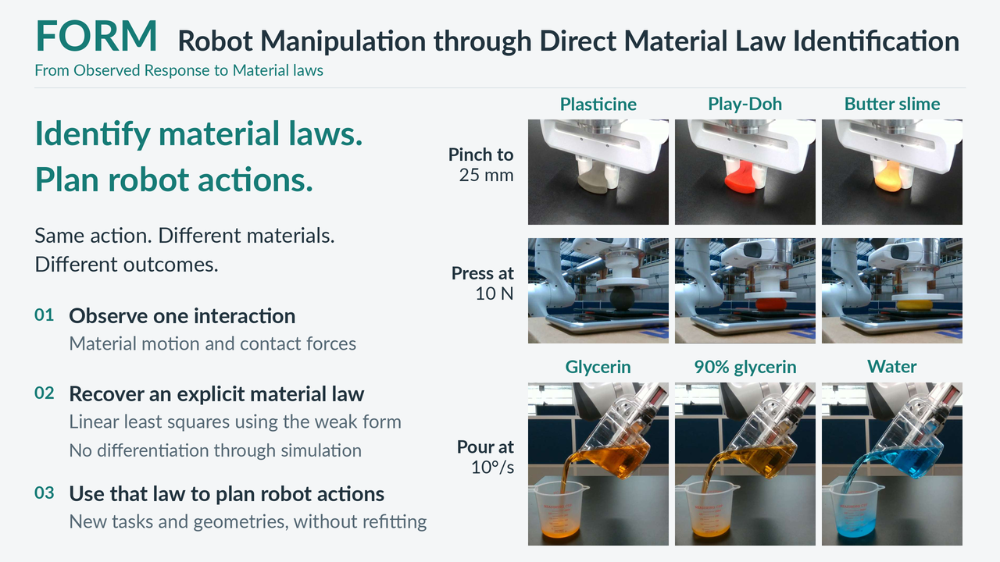

# FORM

**Robot Manipulation through Direct Material Law Identification**

FORM identifies material laws from observed motion and contact forces,
then uses them to plan new actions for new
geometries, without refitting or differentiating through simulation.



## Setup

Use Linux and Python 3.12. Install [uv](https://docs.astral.sh/uv/) and `ffmpeg`;
GPU simulation requires an NVIDIA GPU, and headless rendering uses EGL.
The required MPM solver and kernels are included.

```bash
uv venv --python 3.12
uv pip install --python .venv/bin/python -r requirements-lock.txt
uv pip install --python .venv/bin/python --no-deps -e '.[paper,dev]'
source .venv/bin/activate
```

## Reproduce

**Datasets are not yet publicly hosted.** Recordings and saved simulation data
are distributed separately from Git. Once you have the [data archives](data/README.md):

```bash
python -m reproduce.data unpack /path/to/form-*.tar.gz
python -m reproduce.data verify
python -m reproduce.verify
```

The last command recomputes material estimates and checks saved result metrics
on CPU. For simulations, planning, and baseline comparisons, follow the
[reproduction guide](docs/reproduction.md), which also documents validation limits.

- [Experiments](experiments/): rod insertion, golf, shaping, and pouring.
- [Identification](src/ident/) and [MPM solver](src/warpmpm/): core implementation.
- [Video and slides](presentation/README.md): rendering code and export instructions.
- [Attribution](AUTHORS.md) and [license](LICENSE).
